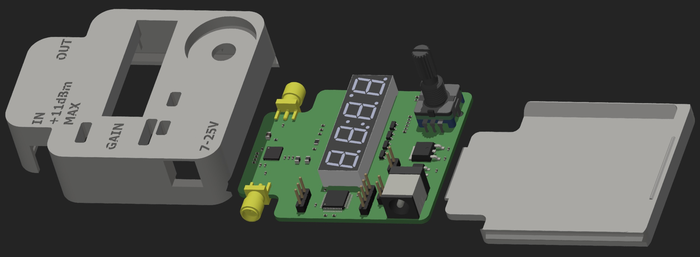
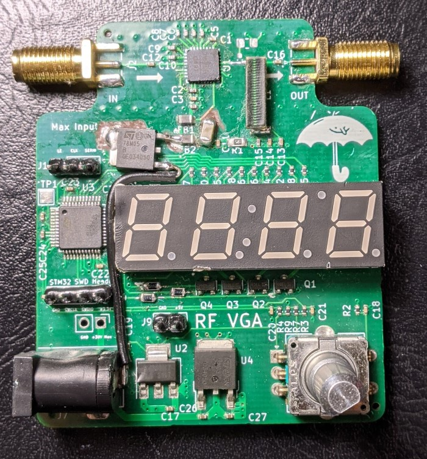
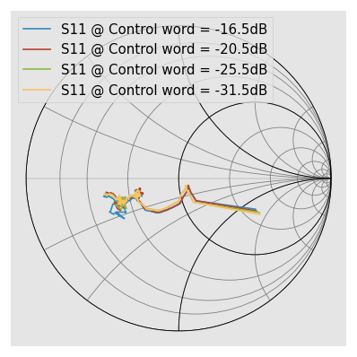
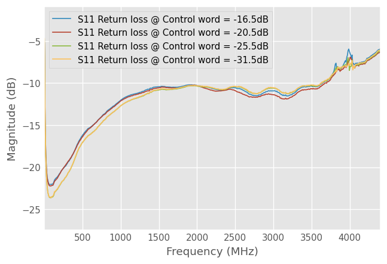
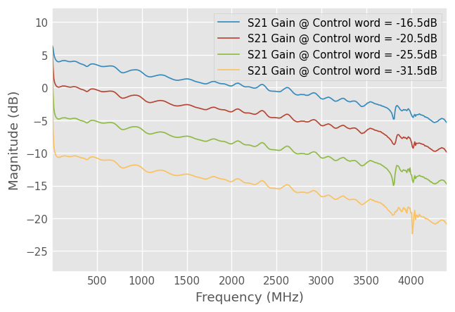

# RF-VGA
A handy RF amplifier/attenuator tool for the lab. Based on a Hittite HMC625B.

- Frequency: 50MHz to 4GHz (see response plots below for roll off)
- Approximate gain / attenuation range: -10dB to +20dB
- Max input power: 11dBm
- Max output power: 16dBm (1dB compression point)

# Render:

# Board photo:

# VNA characterization results:

